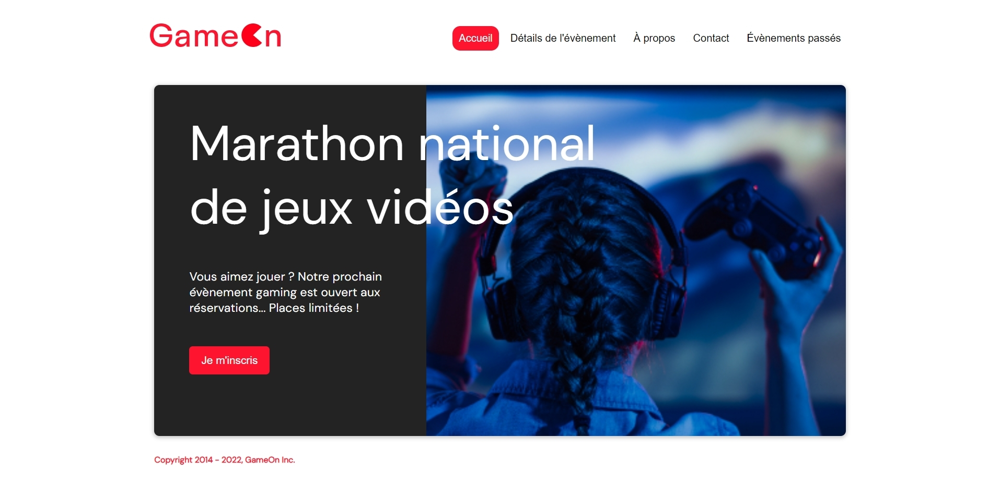

[![Contributors][contributors-shield]][contributors-url]
[![Forks][forks-shield]][forks-url]
[![Stargazers][stars-shield]][stars-url]
[![Issues][issues-shield]][issues-url]

### 📌 GameOn_BAAR_Nicolas

## À propos :

Hello World ! 👋 GameOn est un projet de développement Front-end de la formation [OpenClassrooms React](https://openclassrooms.com/fr/paths/516-developpeur-dapplication-javascript-react). Vous retrouverez toutes les informations utiles en dessous de la description.

To-do liste du projet :

- Fermeture de la modale au click du bouton,
- Implémentation des entrées du formulaire (Regex),
- Ajout de validation ou messages d'erreur,
- Ajout de la confirmation une fois le formulaire rempli,
- Amélioration du code/structure HTML/CSS,
- Tests manuels de compatibilité navigateur.

## Développé avec :

Liste de tous les langages utilisés pour la création du site :

- [HTML](https://developer.mozilla.org/fr/docs/Web/HTML)
- [CSS](https://developer.mozilla.org/fr/docs/Web/CSS)
- [JS](https://developer.mozilla.org/fr/docs/Web/JavaScript)

## Contacts

Nicolas BAAR - [@MeesN](https://nicolasbaar.fr/) - nicolasbaar@outlook.fr

Lien du projet : [https://github.com/NicolasMB3/GameOn_BAAR_Nicolas](https://github.com/NicolasMB3/GameOn_BAAR_Nicolas)

(<a href="#top">Revenir en haut de la page</a>)

[contributors-shield]: https://img.shields.io/github/contributors/NicolasMB3/GameOn_BAAR_Nicolas.svg?style=for-the-badge
[contributors-url]: https://github.com/NicolasMB3/GameOn_BAAR_Nicolas/graphs/contributors
[forks-shield]: https://img.shields.io/github/forks/NicolasMB3/GameOn_BAAR_Nicolas.svg?style=for-the-badge
[forks-url]: https://github.com/NicolasMB3/GameOn_BAAR_Nicolas/pulse
[stars-shield]: https://img.shields.io/github/stars/NicolasMB3/GameOn_BAAR_Nicolas.svg?style=for-the-badge
[stars-url]: https://github.com/NicolasMB3/GameOn_BAAR_Nicolas/stargazers
[issues-shield]: https://img.shields.io/github/issues/NicolasMB3/GameOn_BAAR_Nicolas.svg?style=for-the-badge
[issues-url]: https://github.com/NicolasMB3/GameOn_BAAR_Nicolas/issues
